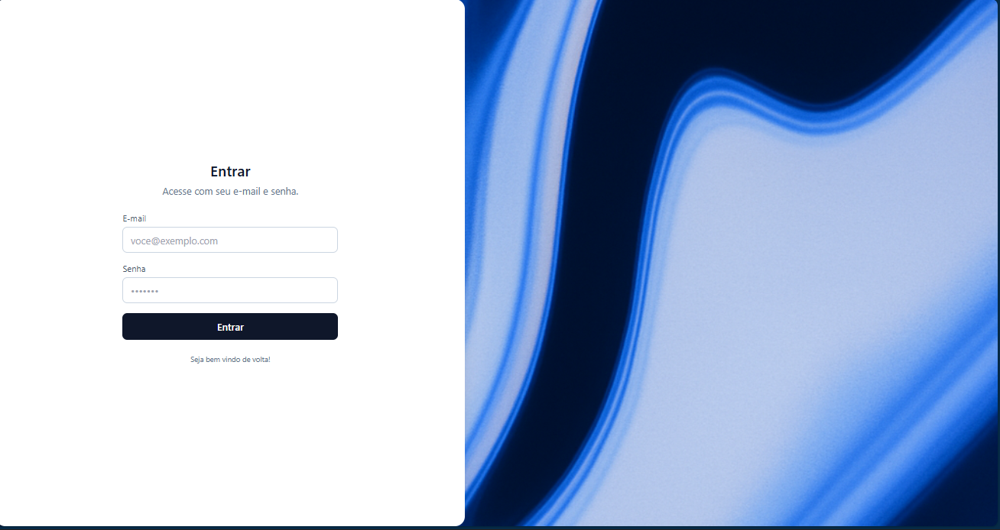

# Project Frontend IA



Aplicacao SPA para autenticacao via JWT e gestao de produtos (cadastro, listagem e exclusao) construida com React, Vite, TypeScript e Tailwind. Este repositorio contem apenas o front-end; o back-end em Spring Boot com PostgreSQL esta em projeto separado.

## Tecnologias principais
- React 18 com Vite e TypeScript
- Tailwind CSS para estilizacao responsiva
- Axios para comunicacao com a API REST
- React Router para sessao e rotas protegidas

## Login
Para realizar login utilize 
```bash
  email: admin@local.com
  senha: admin
```

## Recursos implementados
- Autenticacao via login com armazenamento de token JWT
- Dashboard com listagem dos produtos retornados pela API
- Exclusao de produtos com atualizacao imediata da interface
- Modal controlado para cadastro de novos produtos com limitacao de caracteres e feedback de erro
- Tratamento padrao para descricao ausente e exibicao de icone de exclusao

## Requisitos
- Docker e Docker Compose
- Opcional: Node.js 18+ caso deseje rodar os scripts diretamente

## Variaveis de ambiente
A aplicacao utiliza `VITE_API_URL` para montar o cliente HTTP. O `.env` de exemplo ja aponta para o backend de teste.

## Como executar com Docker
```bash
docker compose up --build frontend
# aplicacao disponivel em http://localhost:4173
```
- Finalize com `docker compose down`.
- Ao alterar dependencias, execute `docker compose build --no-cache frontend` para recompor a imagem.


## Estrutura principal
- `src/services/api.ts` cliente Axios com interceptadores para token JWT
- `src/context/AuthContext.tsx` gerenciamento de sessao e persistencia do token
- `src/components/ProtectedRoute.tsx` protecao de rotas autenticadas
- `src/components/Modal.tsx` formulario controlado para cadastrar produtos
- `src/pages/Login.tsx` tela de login integrada ao backend
- `src/pages/Dashboard.tsx` listagem, exclusao e acionamento do modal de cadastro

## Uso de IA no desenvolvimento - DOCUMENTAÇÃO

Durante o desenvolvimento, utilizei Inteligência Artificial (Codex) como ferramenta de apoio em várias etapas do projeto:

- **Geração e refino de código**: a IA auxiliou na criação do modal controlado de produtos, implementando validações de campos, limitação de caracteres e integração com a API de forma mais rápida e estruturada.
- **Integração entre componentes**: contribuiu para conectar o Dashboard ao Modal, garantindo abertura controlada, e o reaproveitamento do cliente Axios já existente.
- **Resolução de erros e ajustes de configuração**: todos os problemas mais comuns de configuração durante o desenvolvimento foram solucionados com auxílio da IA, acelerando o processo e garantindo estabilidade na aplicação.
- **Documentação e automação**: gerou instruções para o build Docker multi-stage, revisou scripts de execução e auxiliou na redação deste README, com foco em clareza e organização.

Todas as sugestões geradas foram revisadas, testadas e adaptadas manualmente, assegurando que o resultado final estivesse alinhado aos requisitos do projeto e às boas práticas de desenvolvimento.